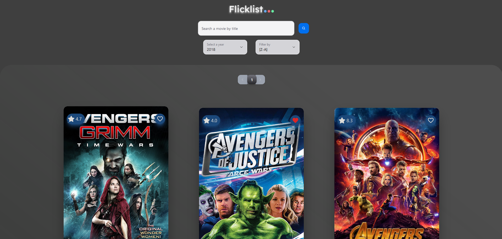

# Flicklist - Movie Search and Bookmarking App

## Technologies I Am Using

This project uses React.js on the frontend.

All components are using [NextUI](https://nextui.org) - a powerful React UI library.

State Management: Context API, [Recoil](https://recoiljs.org)

## Setup

1. Clone this repository:

`git clone https://github.com/cannibalhulk/flicklist-movie-app.git`

2. Install dependencies:

`npm install`

3. Run development server:

`npm run dev` or `npx vite dev`

## Expanding the ESLint configuration

If you are developing a production application, we recommend updating the configuration to enable type aware lint rules:

- Configure the top-level `parserOptions` property like this:
